# Cartão de Vacina Digital App

O aplicativo Carteira de Vacinação Digital é um sistema mobile que promove aos usuários um controle de registro sobre as vacinas que já tomou e as que ainda precisa tomar, seja 2° dose ou vacinas previstas em campanhas de vacinação futuras. Além de registrar suas vacinas também é possível através do aplicativo localizar pontos/postos de vacinação mais próximos da sua localização exibindo quais vacinas estão disponíveis gratuitamente nesses postos e a respectiva faixa etária. Dessa forma além de prover controle ao usuário sobre suas vacinas, também facilitamos o tempo de busca por postos de vacinação para tomar vacinas.

## Storyboard

O storyboard é a primeira etapa de desenvolvimento do app, nele buscamos encontrar um cenário de utilização do mesmo.

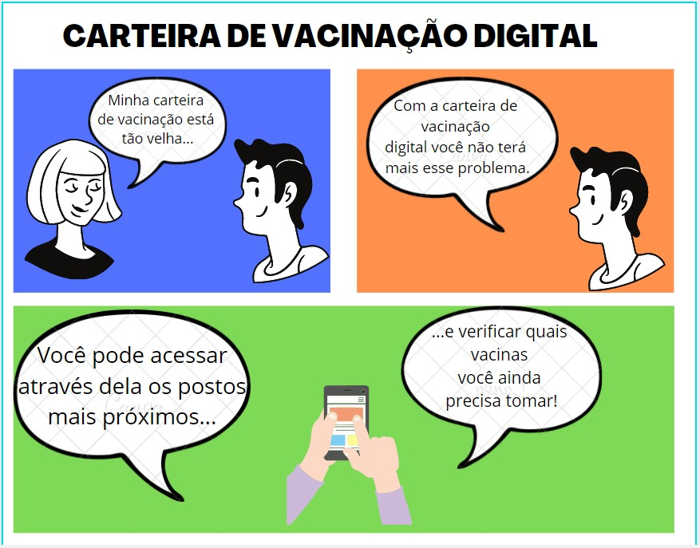

## Mapa Conceitual

O nosso mapa conceitual tem como objetivo definir todos os nichos, seja de negócio, funcionamento e/ou desenvolvimento do aplicativo.

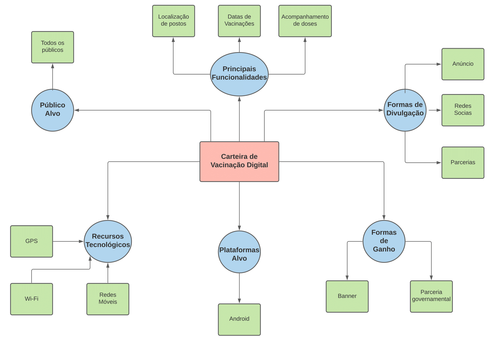

## Diagrama de casos de uso

O diagrama de casos mostra as possíveis interações entre o usuário e o sistema. 

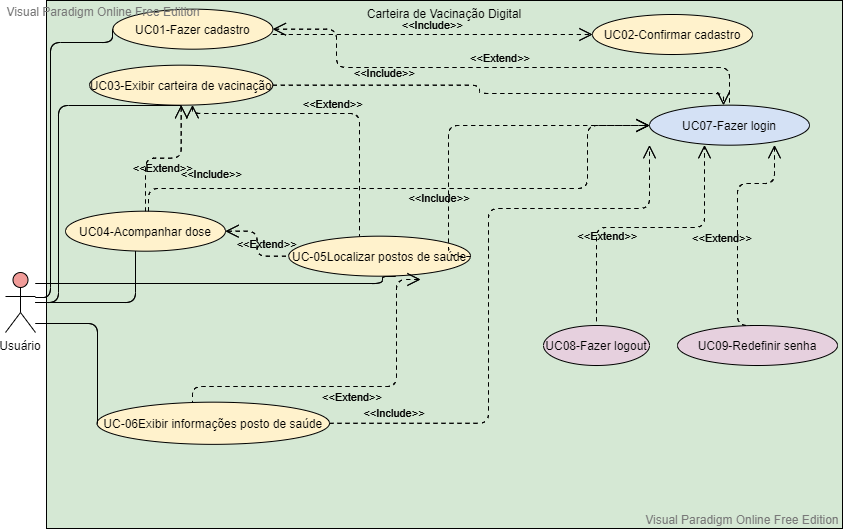

## Cenários de uso

Os cenários de uso nos permite visualizar os diferentes casos de uso do sistema.

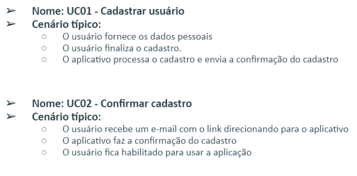

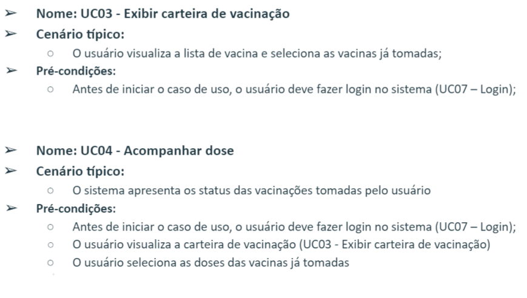

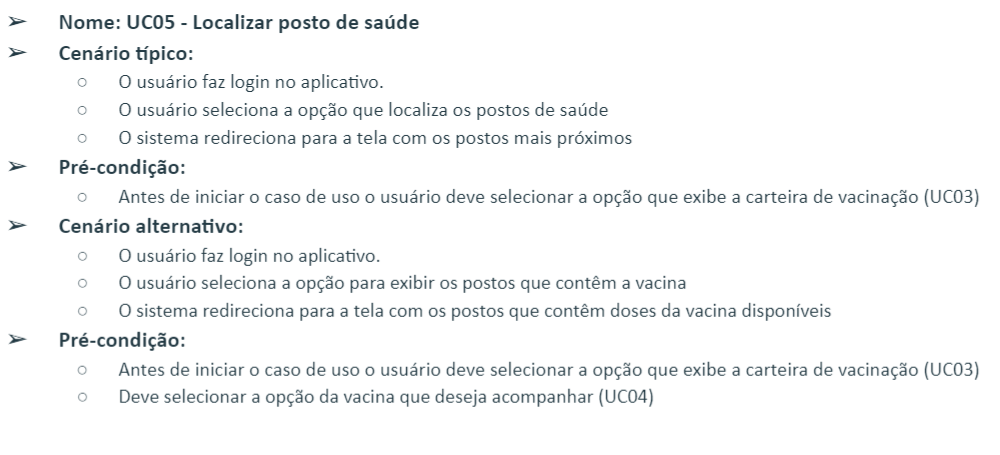

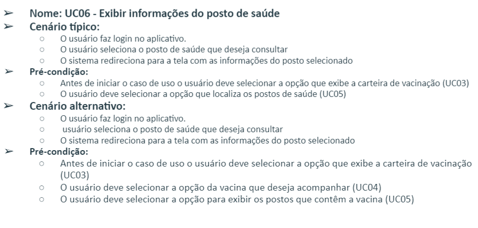

### [Definição de requisitos](https://github.com/jessicacardoso1/carteira-vacinacao/blob/main/doc/definicaoderequisitos/denificaoderequistos.pdf)

## Protótipo de baixa fidelidade

O protótipo de baixa fidelidade foi o primeiro esboço do nosso app e nos permitiu visualizar as funcionalidades do sistema. O objetivo era isolar as interações e focar em como o app se moldaria. 

## Protótipo de alta fidelidade

O protótipo de alta fidelidade é a representação das telas do app. É a última etapa antes da implementação. 

### Tela de Login
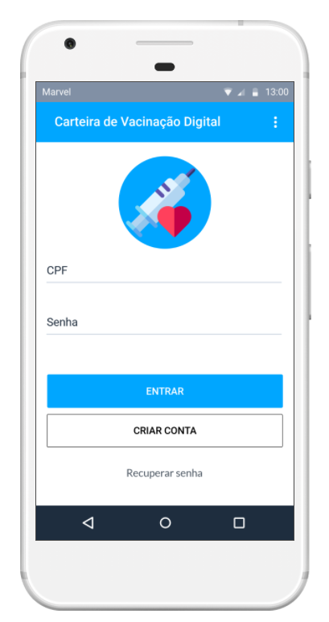

### Tela de casdastro
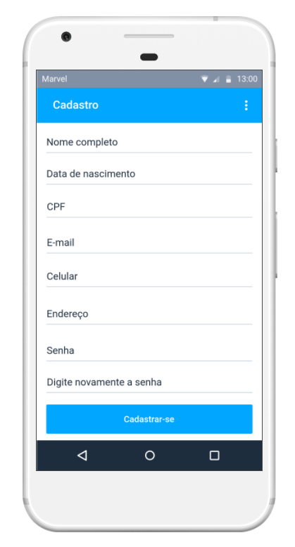

### Home 
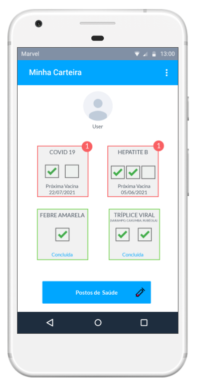

### Tela de acompanhamento da dose
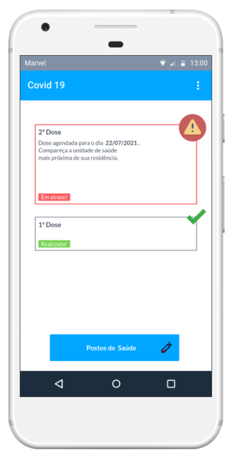

### Tela com os postos mais próximos
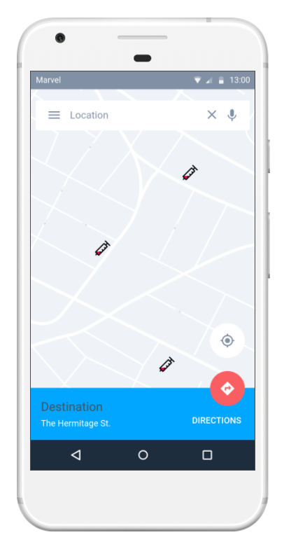

### Tela com informações dos postos de saúde
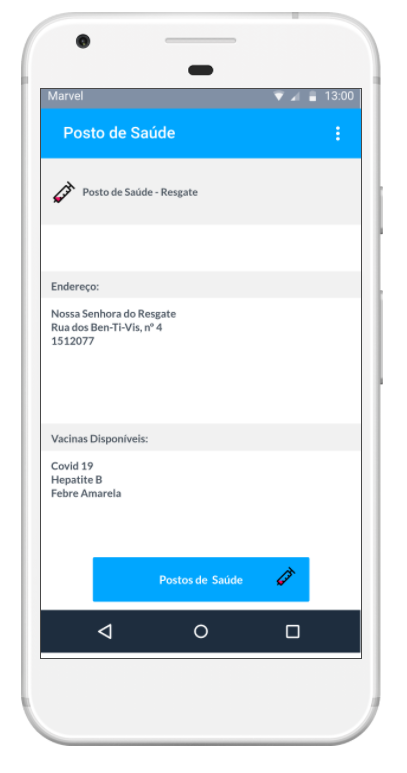

## Aplicações correlatas

Segue abaixo algumas aplicações correlatas.

### Caderno de Vacinas Digital: + 10 mil Downloads 

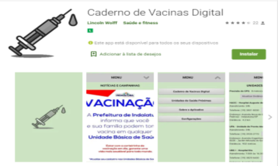

### Minhas Vacinas: + 10 mil Downloads

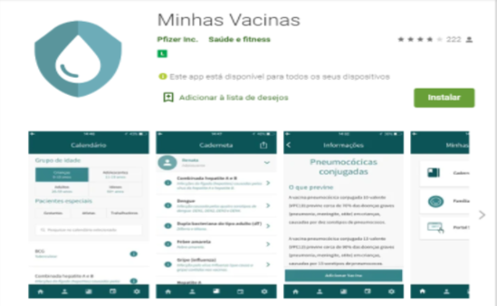

 
 ####
## Desenvolvedores:

Aron Brito

Ítalo Cruz

Jéssica Cardoso

Ludmila Brito

## Requitos Mobile:

| Características | Status | 
|--- |--- |
| Preferências | OK | 
| Permissão | OK |
| Internacionalização | OK |
| Persistência em SQLite| OK | 
| Google Analytic| OK | 
| Comunicação com Servidor(Json)| Pendente | 
